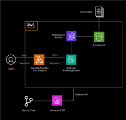

# LOKA Challenge

As stated in the challenge, Company X's main paint point is that currently their developers lose time and interrupt coworkers asking simple questions, while the answers are already available in the company's documentation.

In order to solve this problem it is proposed an LLM-based chatbot with Retrieval Augmented Generation capabilities, using the company's documentation for the dataset. This way, the developers could ask their questions to the chatbot, get the answers they need, and even get references from the documentation for further reading.

This repository contains an implementation of such a system, using several AWS Services: Amazon S3, Bedrock Knowledge Bases, and OpenSearch Service.

The diagram of the architecture is as follows:




In ./Deployment, the source code for the code developed using AWS CDK is available to deploy the resources. It can be deployed in a bootstrapped AWS environment with:

```cdk deploy --all```

In ./Frontend, a simple chat application has been included for demonstration purposes. It can be served as a static website. The only modificantion it needs to work is to fill the backend_url variable with the lambda url generated
